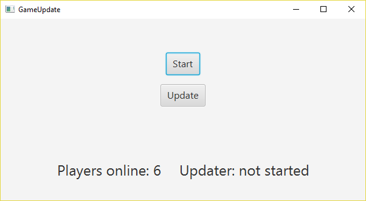
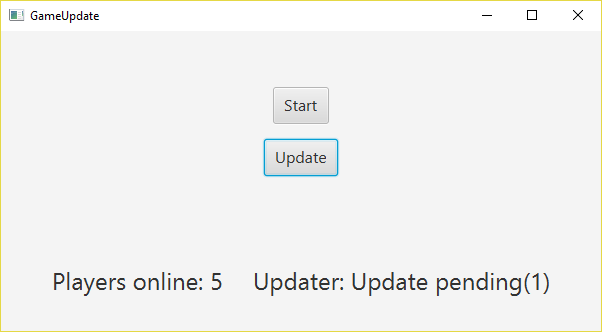
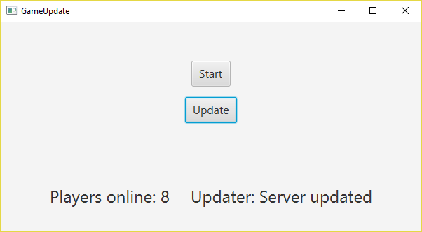

# IPC-Problem Baminger Feck-Melzer 
*Author: Baminger, Feck-Melzer  
 Class: 3AHIF   
 Readers-Writers Problem Simulation*

### Situation: Online-Spiel Update
    Es wird eine Situation Simuliert, in der mehrere Spieler gleichzeitig ein Spiel mit Online-Zwang
    spielen. Das heißt, dass jeder PC, auf dem das Spiel gespielt wird, mit dem Server des Spieles
    über das Internet verbunden sein muss. Bei einem Update des Spielservers darf kein Spieler mit
    selbigem verbunden sein. Nach Drei Update-Versuchen des Servers wird das Update erzwungen, im
    Zuge dessen werden alle noch verbundenen Spieler vom Server getrennt. Diese Situation gleicht
    einer Nachricht, die man Ingame erhält wenn ein Update des Servers durchgeführt werden muss. 
    Nachdem das Update durchgeführt wurde dürfen sich sämtliche Spieler wieder mit dem Server
    verbinden und weiterspielen, bis zum nächsten Serverupdate versteht sich.

  ## Spielgeschehen vor dem Update
  
  

  ## Update wurde gequeued

  

  ## Spielgeschehen nach dem Update

  
  
 
 
 
 ## Wir entschuldigen uns nochmal wegen der verspäteten Abgabe!
